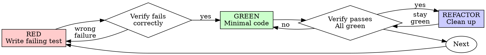

# Test-Driven Development (TDD)

## Overview

Write the test first. Watch it fail. Write minimal code to pass.

**Core principle:** if you didn't watch the test fail, you don't know if it
tests the right thing.

## The Cycle Contract

Every piece of production code ships with this evidence trail, in this order:

1. **A test written before the code**, naming one behavior.
2. **A recorded run where that test failed** — and failed because the behavior
   is missing, not because of a typo, a missing import, or a syntax error.
3. **The minimal code that makes it pass.**
4. **A recorded run where it passes**, with the rest of the suite green and the
   output pristine.

Code without that trail is not TDD-complete, whatever else is true about it.
When you already wrote the code first, delete it and rebuild it from the tests —
keeping it as reference means adapting it, which produces step 3 without steps 1
and 2.

**Exceptions, with the user's agreement:** throwaway prototypes, generated code,
configuration files.

## Red-Green-Refactor



### RED — write the failing test

One minimal test showing what should happen.

<Good>
```typescript
test('retries failed operations 3 times', async () => {
  let attempts = 0;
  const operation = () => {
    attempts++;
    if (attempts < 3) throw new Error('fail');
    return 'success';
  };

  const result = await retryOperation(operation);

  expect(result).toBe('success');
  expect(attempts).toBe(3);
});
```
Clear name, tests real behavior, one thing
</Good>

<Bad>
```typescript
test('retry works', async () => {
  const mock = jest.fn()
    .mockRejectedValueOnce(new Error())
    .mockRejectedValueOnce(new Error())
    .mockResolvedValueOnce('success');
  await retryOperation(mock);
  expect(mock).toHaveBeenCalledTimes(3);
});
```
Vague name, tests mock not code
</Bad>

**Requirements:** one behavior, clear name, real code (no mocks unless unavoidable).

### Verify RED — watch it fail

```bash
npm test path/to/test.test.ts
```

The run must show: the test fails (not errors), the failure message is the one
you expected, and it fails because the feature is missing.

- **Test passes?** You're testing behavior that already exists. Fix the test.
- **Test errors?** Fix the error and re-run until it fails correctly.

### GREEN — minimal code

Simplest code that passes.

<Good>
```typescript
async function retryOperation<T>(fn: () => Promise<T>): Promise<T> {
  for (let i = 0; i < 3; i++) {
    try {
      return await fn();
    } catch (e) {
      if (i === 2) throw e;
    }
  }
  throw new Error('unreachable');
}
```
Just enough to pass
</Good>

<Bad>
```typescript
async function retryOperation<T>(
  fn: () => Promise<T>,
  options?: {
    maxRetries?: number;
    backoff?: 'linear' | 'exponential';
    onRetry?: (attempt: number) => void;
  }
): Promise<T> {
  // YAGNI
}
```
Over-engineered
</Bad>

Don't add features, refactor other code, or improve beyond the test.

### Verify GREEN — watch it pass

```bash
npm test path/to/test.test.ts
```

The run must show the test passing, the other tests still passing, and pristine
output — no errors, no warnings.

- **Test fails?** Fix the code, not the test.
- **Other tests fail?** Fix them now.

### REFACTOR — clean up

After green only: remove duplication, improve names, extract helpers. Keep tests
green. Don't add behavior.

## Good Tests

| Quality | Good | Bad |
|---------|------|-----|
| **Minimal** | One thing. "and" in name? Split it. | `test('validates email and domain and whitespace')` |
| **Clear** | Name describes behavior | `test('test1')` |
| **Shows intent** | Demonstrates desired API | Obscures what code should do |

When writing or changing any test, read [writing-good-tests.md](writing-good-tests.md)
for the rules that keep tests honest:

- Name the production change that would make the test fail — before writing it
- Assert on real behavior, never on mock behavior
- Keep test-only code in test utilities, out of production classes
- Understand a dependency's side effects before mocking it

## Common Rationalizations

| Excuse | Reality |
|--------|---------|
| "I'll test after" | Tests written after pass immediately — which proves nothing. They may test the wrong thing, test the implementation instead of the behavior, or miss the edge case you forgot. You never watched it fail, so you never proved it can catch the bug. |
| "Already manually tested it" | Manual testing leaves no record of what was covered and no way to re-run it. "Worked when I tried it" ≠ comprehensive. |
| "Deleting X hours of work is wasteful" | That time is spent either way. The real choice is rebuilding with TDD (high confidence) or bolting tests onto code you can't trust (low confidence, likely bugs). |
| "Too simple to test" | Simple code breaks. The test takes 30 seconds. |

## Example: Bug Fix

**Bug:** empty email accepted

**RED**
```typescript
test('rejects empty email', async () => {
  const result = await submitForm({ email: '' });
  expect(result.error).toBe('Email required');
});
```

**Verify RED**
```bash
$ npm test
FAIL: expected 'Email required', got undefined
```

**GREEN**
```typescript
function submitForm(data: FormData) {
  if (!data.email?.trim()) {
    return { error: 'Email required' };
  }
  // ...
}
```

**Verify GREEN**
```bash
$ npm test
PASS
```

**REFACTOR** — extract validation if multiple fields need it.

## Completion Checklist

- [ ] Every new function/method has a test
- [ ] Watched each test fail before implementing
- [ ] Each test failed for the expected reason (feature missing, not typo)
- [ ] Wrote minimal code to pass each test
- [ ] All tests pass, output pristine
- [ ] Tests use real code (mocks only if unavoidable)
- [ ] Edge cases and errors covered

## When Stuck

| Problem | Solution |
|---------|----------|
| Don't know how to test | Write the wished-for API. Write the assertion first. Ask the user. |
| Test too complicated | Design too complicated. Simplify the interface. |
| Must mock everything | Code too coupled. Use dependency injection. |
| Test setup huge | Extract helpers. Still complex? Simplify the design. |

## Debugging Integration

Bug found? Write the failing test that reproduces it, then follow the cycle. The
test proves the fix and prevents the regression. Never fix a bug without one.
