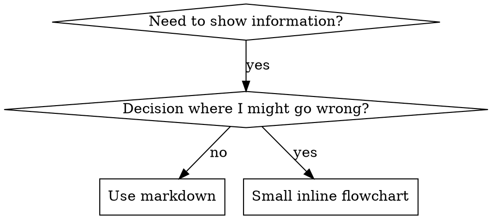

# Writing Skills

**Writing skills IS Test-Driven Development applied to process documentation.**

**Personal skills live in `~/.claude/skills/`.** Project skills live in
`.claude/skills/`; plugin skills live in the plugin's `skills/` directory.

You write test cases (pressure scenarios with subagents), watch them fail (baseline behavior), write the skill (documentation), watch tests pass (agents comply), and refactor (close loopholes).

**Core principle:** If you didn't watch an agent fail without the skill, you don't know if the skill teaches the right thing.

**REQUIRED BACKGROUND:** You MUST understand superpowers:test-driven-development before using this skill. That skill defines the fundamental RED-GREEN-REFACTOR cycle. This skill adapts TDD to documentation.

**Official guidance:** For Anthropic's official skill authoring best practices, see anthropic-best-practices.md. This document provides additional patterns and guidelines that complement the TDD-focused approach in this skill.

## What is a Skill?

A **skill** is a reference guide for proven techniques, patterns, or tools. Skills help future agents find and apply effective approaches.

**Skills are:** Reusable techniques, patterns, tools, reference guides

**Skills are NOT:** Narratives about how you solved a problem once

## When to Create a Skill

**Create when:**
- Technique wasn't intuitively obvious to you
- You'd reference this again across projects
- Pattern applies broadly (not project-specific)
- Others would benefit

**Don't create for:**
- One-off solutions
- Standard practices well-documented elsewhere
- Project-specific conventions (put in your instructions file)
- Mechanical constraints (if it's enforceable with regex/validation, automate it—save documentation for judgment calls)

## Skill Types

### Technique
Concrete method with steps to follow (condition-based-waiting, root-cause-tracing)

### Pattern
Way of thinking about problems (flatten-with-flags, test-invariants)

### Reference
API docs, syntax guides, tool documentation (office docs)

## Directory Structure

```
skills/
  skill-name/
    SKILL.md              # Main reference (required)
    supporting-file.*     # Only if needed
```

**Flat namespace** - all skills in one searchable namespace

**Separate files for:**
1. **Heavy reference** (100+ lines) - API docs, comprehensive syntax
2. **Reusable tools** - Scripts, utilities, templates

**Keep inline:**
- Principles and concepts
- Code patterns (< 50 lines)
- Everything else

## SKILL.md Structure

**Frontmatter (YAML):**
- Two required fields: `name` and `description` (see [agentskills.io/specification](https://agentskills.io/specification) for all supported fields)
- Max 1024 characters total
- `name`: Use letters, numbers, and hyphens only (no parentheses, special chars)
- `description`: Third-person, describes ONLY when to use (NOT what it does)
  - Start with "Use when..." to focus on triggering conditions
  - Include specific symptoms, situations, and contexts
  - **NEVER summarize the skill's process or workflow** (see SDO section for why)
  - Keep under 500 characters if possible

**REQUIRED SUB-SKILL:** Use superpowers:writing-clearly-and-concisely for the
prose itself. It governs the sentences; Match the Form to the Failure below
governs which sections exist.

**Body:** there is no fixed section list. Write the sections this skill's failure
modes need and nothing else. Only two are load-bearing everywhere:

```markdown
---
name: skill-name-with-hyphens
description: Use when [specific triggering conditions and symptoms]
---

# Skill Name

[Opening: what this is and the core principle, in 1-3 sentences. No `## Overview`
heading — the reader has already invoked the skill and knows what they opened.]

[Then the sections the failure modes call for. Common, not mandatory:
 - When to Use / When Not to — only when the routing decision is non-obvious
 - The procedure, contract, or pattern — the actual instructions
 - Quick Reference table — only when there are operations worth scanning for
 - Common Rationalizations — one table, for discipline failures, from observed
   baselines. See Bulletproofing.]
```

**Sections to leave out unless you can name the failure they fix:** `## Overview`
(the title already says it), Real-World Impact, Advantages, Key Principles,
Bottom Line, and any closing recap. These were removed library-wide because they
address a reader deciding *whether* to adopt the skill — and by the time the body
loads, that decision is already made. Selling costs tokens on every invocation.

## Skill Discovery Optimization (SDO)

**Critical for discovery:** Future agents need to FIND your skill

### 1. Rich Description Field

**Purpose:** Your agent reads the description to decide which skills to load for a given task. Make it answer: "Should I read this skill right now?"

**Format:** Start with "Use when..." to focus on triggering conditions

**CRITICAL: Description = When to Use, NOT What the Skill Does**

The description should ONLY describe triggering conditions. Do NOT summarize the skill's process or workflow in the description.

**Why this matters:** when a description summarizes the workflow, agents follow
the summary instead of reading the skill. In testing, a description saying "code
review between tasks" produced exactly one review per task — the skill body
specified two distinct verdicts, and the agent never got there. Changing the
description to triggering conditions only ("Use when executing implementation
plans with independent tasks") produced both verdicts.

**The trap:** Descriptions that summarize workflow create a shortcut agents will take. The skill body becomes documentation agents skip.

```yaml
# ❌ BAD: Summarizes workflow - agents may follow this instead of reading skill
description: Use when executing plans - dispatches subagent per task with code review between tasks

# ❌ BAD: Too much process detail
description: Use for TDD - write test first, watch it fail, write minimal code, refactor

# ✅ GOOD: Just triggering conditions, no workflow summary
description: Use when executing implementation plans with independent tasks in the current session

# ✅ GOOD: Triggering conditions only
description: Use when implementing any feature or bugfix, before writing implementation code
```

**Content:**
- Use concrete triggers, symptoms, and situations that signal this skill applies
- Describe the *problem* (race conditions, inconsistent behavior) not *language-specific symptoms* (setTimeout, sleep)
- Keep triggers technology-agnostic unless the skill itself is technology-specific
- If skill is technology-specific, make that explicit in the trigger
- Write in third person (injected into system prompt)
- **NEVER summarize the skill's process or workflow**

```yaml
# ❌ BAD: Too abstract, vague, doesn't include when to use
description: For async testing

# ❌ BAD: First person
description: I can help you with async tests when they're flaky

# ❌ BAD: Mentions technology but skill isn't specific to it
description: Use when tests use setTimeout/sleep and are flaky

# ✅ GOOD: Starts with "Use when", describes problem, no workflow
description: Use when tests have race conditions, timing dependencies, or pass/fail inconsistently

# ✅ GOOD: Technology-specific skill with explicit trigger
description: Use when using React Router and handling authentication redirects
```

### 2. Keyword Coverage

Use words an agent would search for:
- Error messages: "Hook timed out", "ENOTEMPTY", "race condition"
- Symptoms: "flaky", "hanging", "zombie", "pollution"
- Synonyms: "timeout/hang/freeze", "cleanup/teardown/afterEach"
- Tools: Actual commands, library names, file types

### 3. Descriptive Naming

Name by the action or the core insight, verb-first and active. Gerunds (`-ing`)
suit processes: `creating-skills`, `debugging-with-logs`.

- ✅ `condition-based-waiting` > `async-test-helpers`
- ✅ `root-cause-tracing` > `debugging-techniques`
- ✅ `flatten-with-flags` > `data-structure-refactoring`
- ✅ `creating-skills` > `skill-creation`

### 4. Progressive Disclosure

Four tiers load at different times. Write for the tier.

| Tier | Loads | Budget |
|------|-------|--------|
| `description` | Always, for every skill installed | One sentence of triggers |
| Session bootstrap (e.g. using-superpowers) | Every conversation, injected by a SessionStart hook | Under ~200 words |
| `SKILL.md` | When the skill is invoked | Aim under ~500 words of instruction; more only if every line is load-bearing |
| Reference files | Only when the skill says to read them | As long as the material needs |

The first two tiers are paid for whether or not the skill is ever used. Get the
real numbers rather than estimating: `claude plugin details <plugin>` prints
always-on and on-invoke cost per component.

**A description character costs ~25x a body character, so trim descriptions
first.** Both sit in context once present and are re-read on every subsequent
turn — but the description is there from turn 1 of every session whether the skill
is invoked or not, while the body costs nothing until invocation. Measured on this
library: the 15 descriptions total ~1.6k characters injected into every session,
and a typical run re-reads its context ~25 times. Cutting 100 characters of
description therefore removes ~600 token-reads per run; cutting 100 characters of
body removes that only in the runs that load it.

Measured against the same runs, body length is a rounding error: a 21-33%
compression of two skills' bodies changed total run cost by less than the
run-to-run noise, because the body was ~0.08% of the tokens consumed. Cost lives
in context size multiplied by turn count, not in prose length. **Do not compress a
body for cost reasons** — compress it when it is repetitive (above), and leave it
alone otherwise.

**What a description may not give up to get shorter:** the triggering conditions
and the symptom keywords an agent would search for. Provenance is the cheap thing
to cut — "invoked by X and Y at their review points" tells an agent nothing about
when to reach for the skill, and callers that invoke it by name do not read the
listing to find it. When every remaining clause is a trigger or a keyword, the
description is done; shaving another ten characters risks a triggering regression
worth far more than the tokens.

**Instruction density beats brevity.** A long SKILL.md is not the failure mode —
a *repetitive* one is. Stating the same rule as a principle, then a prohibition
list, then a rationalization table, then a red-flags list teaches the reader that
this document restates itself, and they start skimming the parts that matter. Say
each thing once, in the form that fits its failure (see Match the Form to the
Failure).

**Move depth out, not away:**

```bash
# ❌ Document every flag in SKILL.md
search-conversations supports --text, --both, --after DATE, --before DATE, --limit N

# ✅ Point at the source of truth
search-conversations supports multiple modes and filters. Run --help for details.
```

Cross-reference rather than restate: `**REQUIRED SUB-SKILL:** Use superpowers:test-driven-development`
instead of paraphrasing that skill's workflow. A paraphrase drifts from the
original and becomes a second, wrong copy.

**One example per pattern**, in the single most relevant language. A second
example of the same idea costs tokens and teaches nothing new — and five
translations of it cost five times that while each gets less review than one
would have. Choose by domain: testing → TypeScript, system debugging →
shell/Python, data → Python. You are good at porting; one great example is
enough.

**Verification:**
```bash
wc -w skills/path/SKILL.md
```
Then read it: could a reader who follows only the headings do the right thing? Is
any rule stated more than once?

### 5. Cross-Referencing Other Skills

**When writing documentation that references other skills:**

Use skill name only, with explicit requirement markers:
- ✅ Good: `**REQUIRED SUB-SKILL:** Use superpowers:test-driven-development`
- ✅ Good: `**REQUIRED BACKGROUND:** You MUST understand superpowers:systematic-debugging`
- ❌ Bad: `See skills/testing/test-driven-development` (unclear if required)
- ❌ Bad: `@skills/testing/test-driven-development/SKILL.md` (force-loads, burns context)

**Why no @ links:** `@` syntax force-loads files immediately, consuming 200k+ context before you need them.

## Flowchart Usage



**Use flowcharts ONLY for:**
- Non-obvious decision points
- Process loops where you might stop too early
- "When to use A vs B" decisions

**Never use flowcharts for:**
- Reference material → Tables, lists
- Code examples → Markdown blocks
- Linear instructions → Numbered lists
- Labels without semantic meaning (step1, helper2)

See `graphviz-conventions.dot` in this directory for graphviz style rules.

**Visualizing for the user:** Use `render-graphs.js` in this directory to render a skill's flowcharts to SVG:
```bash
./render-graphs.js ../some-skill           # Each diagram separately
./render-graphs.js ../some-skill --combine # All diagrams in one SVG
```

## Code Examples

How many and which language is decided under Progressive Disclosure. What makes
the one example good:

- Complete and runnable, from a real scenario
- Commented to explain WHY, not what
- Ready to adapt — not a fill-in-the-blank template with `<YOUR_VALUE_HERE>` slots

## File Organization

### Self-Contained Skill
```
defense-in-depth/
  SKILL.md    # Everything inline
```
When: All content fits, no heavy reference needed

### Skill with Reusable Tool
```
condition-based-waiting/
  SKILL.md    # Overview + patterns
  example.ts  # Working helpers to adapt
```
When: Tool is reusable code, not just narrative

### Skill with Heavy Reference
```
pptx/
  SKILL.md       # Overview + workflows
  pptxgenjs.md   # 600 lines API reference
  ooxml.md       # 500 lines XML structure
  scripts/       # Executable tools
```
When: Reference material too large for inline

## The Iron Law (Same as TDD)

```
NO SKILL WITHOUT A FAILING TEST FIRST
```

This applies to new skills and to edits — including edits that only add a
section. A skill is behavior-shaping code, and an untested edit to a tuned skill
can move compliance in either direction without anyone noticing which.

**REQUIRED BACKGROUND:** The superpowers:test-driven-development skill explains why this matters. Same principles apply to documentation.

## Testing All Skill Types

Different skill types need different test approaches:

### Discipline-Enforcing Skills (rules/requirements)

**Examples:** TDD, verification-before-completion, designing-before-coding

**Test with:**
- Academic questions: Do they understand the rules?
- Pressure scenarios: Do they comply under stress?
- Multiple pressures combined: time + sunk cost + exhaustion
- Identify rationalizations and add explicit counters

**Success criteria:** Agent follows rule under maximum pressure

### Technique Skills (how-to guides)

**Examples:** condition-based-waiting, root-cause-tracing, defensive-programming

**Test with:**
- Application scenarios: Can they apply the technique correctly?
- Variation scenarios: Do they handle edge cases?
- Missing information tests: Do instructions have gaps?

**Success criteria:** Agent successfully applies technique to new scenario

### Pattern Skills (mental models)

**Examples:** reducing-complexity, information-hiding concepts

**Test with:**
- Recognition scenarios: Do they recognize when pattern applies?
- Application scenarios: Can they use the mental model?
- Counter-examples: Do they know when NOT to apply?

**Success criteria:** Agent correctly identifies when/how to apply pattern

### Reference Skills (documentation/APIs)

**Examples:** API documentation, command references, library guides

**Test with:**
- Retrieval scenarios: Can they find the right information?
- Application scenarios: Can they use what they found correctly?
- Gap testing: Are common use cases covered?

**Success criteria:** Agent finds and correctly applies reference information

## Common Rationalizations for Skipping Testing

| Excuse | Reality |
|--------|---------|
| "The skill is obviously clear" | Clear to the author is the one case that proves nothing. Clarity is what the test measures. |
| "Academic review is enough" | Reading the skill and using it are different tasks. Test the application scenario. |
| "It's just a reference" | References have gaps and dead ends. Test retrieval: can an agent find the right section and use it? |
| "I'll test if problems emerge" | The problem emerging *is* an agent failing to use the skill, in someone's real session. |

## Match the Form to the Failure

**This is the first decision, before you write a line of guidance.** Classify the
baseline failure, then pick the form that fits it. The form that bulletproofs one
failure type measurably backfires on another, so guessing costs you the skill.

| Baseline failure | Right form | Wrong form |
|---|---|---|
| Skips/violates a rule under pressure (knows better, does it anyway) | Prohibition + one rationalization table (see Bulletproofing below) | Soft guidance ("prefer...", "consider...") |
| Complies, but output has the wrong shape (bloated prompt, buried verdict, restated spec) | Positive recipe or contract: state what the output IS — its parts, in order | Prohibition list ("don't restate", "never narrate") |
| Omits a required element from something they already produce | Structural: REQUIRED field or slot in the template they fill in | Prose reminders near the template |
| Behavior should depend on a condition | Conditional keyed to an observable predicate ("if the brief exists, reference it") | Unconditional rule + exemption clauses |

**Why prohibitions backfire on shaping problems:** under a competing incentive ("make the prompt self-contained"), agents negotiate with "don't X". In head-to-head wording tests on dispatch-prompt guidance, the prohibition arm produced clearly more of the unwanted content than the recipe arm (fully separated distributions), and trended worse than even the no-guidance control — micro-test your own case rather than assuming, but never reach for the prohibition by default. A recipe leaves nothing to negotiate: the output matches the stated shape or it doesn't.

**Rules for whichever form you pick:**
- **No nuance clauses.** "Don't X unless it matters" reopens the negotiation — appending a single nuance clause to a winning recipe degraded it from consistent to noisy in the same wording tests. Express a real exception as its own conditional on an observable predicate.
- **Exemption clauses don't scope.** "This limit doesn't apply to code blocks" still suppresses code blocks. If part of the output must be exempt, restructure so the rule can't reach it.
- **Structure beats instruction where structure is available.** A reviewer with no
  file-editing tools cannot edit files; a required field in a template gets filled
  in. Prefer a constraint the agent cannot negotiate with over a sentence telling
  it not to.

## Bulletproofing Skills Against Rationalization

**Scope:** discipline failures only — an agent that knows the rule and skips it
under pressure. For wrong-shaped output or omitted elements, this toolkit
backfires; use the forms above.

**Psychology note:** see persuasion-principles.md for the research foundation
(Cialdini, 2021; Meincke et al., 2025) on authority, commitment, scarcity, social
proof, and unity.

### State the rule once, in the form that closes the workaround

A bare rule leaves the workaround open; the fix is to name the workaround in the
rule, not to restate the rule elsewhere.

<Bad>
```markdown
Write code before test? Delete it.
```
</Bad>

<Good>
```markdown
When you already wrote the code first, delete it and rebuild from the tests —
keeping it as reference means adapting it, which produces the implementation
without the failing test.
```
</Good>

The good version carries the reason the workaround fails. That travels; a
prohibition list does not.

### One rationalization table, from real baselines

Capture the excuses agents actually produced in baseline testing (see the Testing
section) and put them in exactly one table. Cap it at the ones you observed —
invented excuses dilute the observed ones.

```markdown
| Excuse | Reality |
|--------|---------|
| "I'll test after" | Tests written after pass immediately — which proves nothing. You never watched it fail, so you never proved it can catch the bug. |
| "Already manually tested it" | Manual testing leaves no record and no way to re-run it. |
```

**Do not also write a Red Flags list of the same items.** A rationalization table
and a red-flags list restating it are the same content twice; the second copy
teaches the reader to skim. Keep a short Red Flags list only when it names
*different* signals — observable states rather than thoughts ("three fixes have
failed", "the diff has no test file").

### Skip the spirit-versus-letter preamble

"Violating the letter is violating the spirit" was written for models that argued
the distinction. If a baseline run shows that argument, add the counter to the
rationalization table with the specific loophole it opened. Don't add it
preemptively.

## RED-GREEN-REFACTOR for Skills

Follow the TDD cycle:

### RED: Write Failing Test (Baseline)

Run pressure scenario with subagent WITHOUT the skill. Document exact behavior:
- What choices did they make?
- What rationalizations did they use (verbatim)?
- Which pressures triggered violations?

This is "watch the test fail" - you must see what agents naturally do before writing the skill.

### GREEN: Write Minimal Skill

Write skill that addresses those specific rationalizations. Don't add extra content for hypothetical cases.

Run same scenarios WITH skill. Agent should now comply.

### REFACTOR: Close Loopholes

Agent found new rationalization? Add explicit counter. Re-test until bulletproof.

### Micro-Test Wording Before Full Scenarios

Full pressure-scenario runs are the final gate, but they are slow and expensive per iteration. Verify the wording itself first with micro-tests:

1. **One fresh-context sample per call** — a raw API call, or a single-shot subagent if you don't have API access. System prompt = the realistic context the guidance will live in (the full skill or prompt template, not the guidance in isolation); user message = a task that tempts the failure.
2. **Always include a no-guidance control.** If the control doesn't exhibit the failure, there is nothing to fix — stop, don't author the guidance.
3. **5+ reps per variant.** Single samples lie.
4. **Manually read every flagged match.** Score programmatically if you like, but template echoes and quoted counter-examples masquerade as hits; automated counts alone overstate both failure and success.
5. **Variance is a metric.** When guidance lands, reps converge on the same shape. Five different interpretations across five reps means the wording isn't binding — tighten the form before adding words.

Micro-tests verify wording; they do not replace pressure scenarios for discipline skills.

**Testing methodology:** See [testing-skills-with-subagents.md](testing-skills-with-subagents.md) for the complete testing methodology:
- How to write pressure scenarios
- Pressure types (time, sunk cost, authority, exhaustion)
- Plugging holes systematically
- Meta-testing techniques

## Anti-Patterns

### ❌ Narrative Example
"In session 2025-10-03, we found empty projectDir caused..."
**Why bad:** Too specific, not reusable

### ❌ Code in Flowcharts
```dot
step1 [label="import fs"];
step2 [label="read file"];
```
**Why bad:** Can't copy-paste, hard to read

### ❌ Generic Labels
helper1, helper2, step3, pattern4
**Why bad:** Labels should have semantic meaning

## One Skill at a Time

Finish the checklist below for the current skill — including its tests — before
starting the next one. Batching several skills and testing at the end means every
later skill inherits whatever the first one got wrong, and you find out about all
of them at once.

## Skill Creation Checklist (TDD Adapted)

**IMPORTANT: Create a todo for EACH checklist item below.**

**RED Phase - Write Failing Test:**
- [ ] Create pressure scenarios (3+ combined pressures for discipline skills)
- [ ] Run scenarios WITHOUT skill - document baseline behavior verbatim
- [ ] Identify patterns in rationalizations/failures

**GREEN Phase - Write Minimal Skill:**
- [ ] Name uses only letters, numbers, hyphens (no parentheses/special chars)
- [ ] YAML frontmatter with required `name` and `description` fields (max 1024 chars; see [spec](https://agentskills.io/specification))
- [ ] Description starts with "Use when..." and includes specific triggers/symptoms
- [ ] Description written in third person
- [ ] Keywords throughout for search (errors, symptoms, tools)
- [ ] Clear overview with core principle
- [ ] Address specific baseline failures identified in RED
- [ ] Guidance form matches the failure type (see Match the Form to the Failure)
- [ ] For behavior-shaping guidance: wording micro-tested against a no-guidance control (5+ reps, every flagged match read manually) — N/A for pure reference skills
- [ ] Code inline OR link to separate file
- [ ] One excellent example (not multi-language)
- [ ] Run scenarios WITH skill - verify agents now comply

**REFACTOR Phase - Close Loopholes:**
- [ ] Identify NEW rationalizations from testing
- [ ] Close each one in the rule itself, or in the single rationalization table
- [ ] Re-test until compliance holds under the pressures you can construct

**Quality Checks:**
- [ ] Small flowchart only if the decision is non-obvious or the loop has cycles prose can't carry
- [ ] No rule stated in more than one place
- [ ] No section that sells the skill to a reader who has already invoked it
- [ ] No narrative storytelling
- [ ] Supporting files only for tools or heavy reference — every one of them referenced from SKILL.md
- [ ] `claude plugin details <plugin>` re-checked: on-invoke cost is what you intended, and always-on cost moved only if you meant it to

**Deployment:**
- [ ] Bump the plugin version, then commit and push — the plugin serves a
      version-keyed cache, so an unbumped edit never reaches a running session
      (see the repo README, "Updating")
